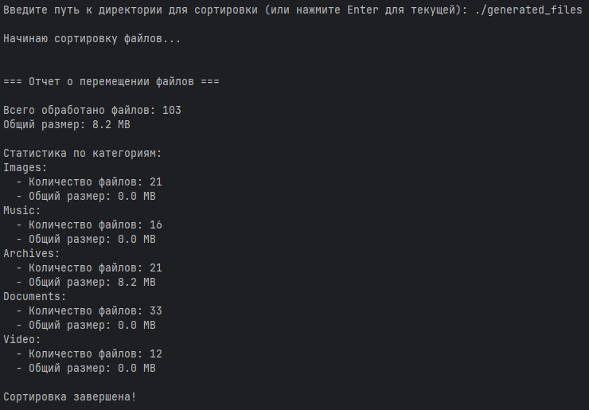
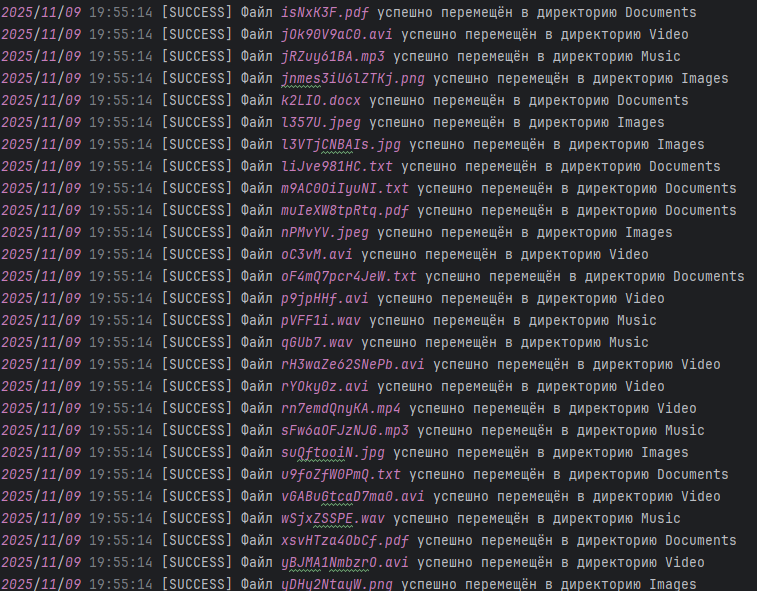

# FileOrganizer

## 📋 Описание проекта

Программа сканирует директорию, определяет типы файлов и распределяет их в соответствующие папки с детальным логированием и статистикой

## 🛠 Основные функции

- **Автоматическая сортировка** — сканирует все файлы в директории рекурсивно
- **Категоризация файлов** — распределяет по 5 типам:
    - 📄 Documents (pdf, doc, docx, txt)
    - 🖼️ Images (jpg, jpeg, png)
    - 🎵 Music (mp3, wav)
    - 🎬 Video (mp4, avi)
    - 📦 Archives (zip, rar)
- **Обработка конфликтов** — автоматически переименовывает файлы с одинаковыми именами через временные метки
- **Подробное логирование** — все операции записываются в organizer.log
- **Статистика** — подсчитывает количество файлов и объем данных по каждой категории
- **Красивые отчеты** — выводит итоговую статистику в консоль


## 🚀 Установка и запуск

### Требования

- Go 1.22 или выше

### Установка

1. Клонируйте репозиторий
   ```bash
   git clone https://github.com/Akbar-cmd/FileOrganizer.git
   ```
2. Перейдите в директорию проекта
   ```bash
   cd FileOrganizer
   ```
3. Запустите программу
   ```bash
   go run main.go
   ```

## 🎮 Примеры использования





